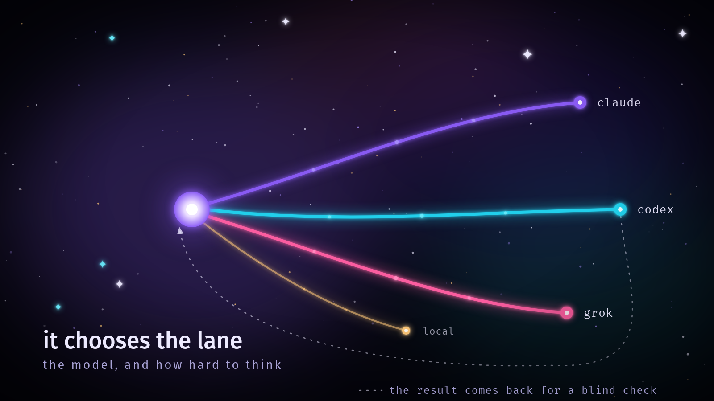
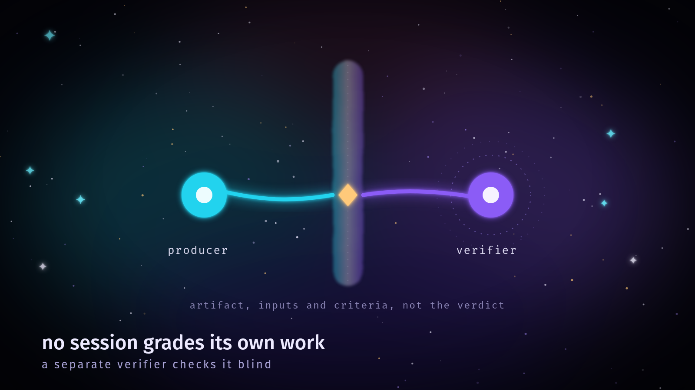

<p align="center">
  
</p>

# Olondunge

**Let the model inside Claude Code, Codex or Grok allocate work to the other agent CLIs on your
machine, choosing the lane, the model and the reasoning effort itself, and have a different
model verify the result blind.**

Olondunge is a local [Model Context Protocol](https://modelcontextprotocol.io) server plus two
skills. Once it is registered, the model you are talking to can say, in effect: "this part is
a quick extraction, run it on the cheapest lane at low effort; this part is subtle, run it on
Codex with the strongest model at its top effort; then have Claude check it without seeing the
producer's conclusion." Olondunge applies that decision against what is actually installed and
healthy, runs the jobs in the background, and returns capped, redacted results with a ledger.

It also ships the **tri-stack compiler**: type `tri: <idea>` and the prompt is compiled into a
full execution contract (requirements, work graph, allocation, blind verification, release
verdict) in the same turn.

## What you get

| Piece | What it does |
|---|---|
| MCP server `olondunge` | `alloc_status`, `alloc_plan`, `alloc_dispatch`, `alloc_poll`, `alloc_collect`, `alloc_verify`, `alloc_call`, `tri_models`, `tri_preflight`, resource `alloc://ledger` |
| Lanes | `claude` (`claude -p`), `codex` (`codex exec`), `grok` (`grok --prompt-file`), `local` (an OpenAI compatible endpoint on loopback, Ollama by default) |
| Skill `olondunge` | teaches the host model the allocation loop, the packet format, and when to pin a lane, model or effort |
| Skill `tristack-compiler` | teaches the host model to obey a tri-stack contract in Claude Code, Codex or Grok |
| `tri:` activation | a UserPromptSubmit hook for Claude Code and Codex; the `tri-grok` entry point for Grok |

<p align="center">
  
</p>

## Requirements

- Python 3.11 or newer and [uv](https://docs.astral.sh/uv/).
- At least one agent CLI, installed and logged in: [Claude Code](https://docs.claude.com/en/docs/claude-code), [Codex CLI](https://github.com/openai/codex), or the Grok CLI. Each lane uses that CLI's own login and subscription; Olondunge never sees or stores credentials.
- Linux or macOS.

## Install

```bash
uv tool install git+https://github.com/mdalexandre/olondunge
olondunge setup all --dry-run   # see exactly what will change
olondunge setup all             # or: setup claude | setup codex | setup grok
olondunge doctor
```

`setup` registers the server with each installed host through its own `mcp add` command,
copies both skills into the host's skills directory, and adds the `tri:` hook for Claude Code
and Codex. The files setup writes itself (the Claude Code `settings.json`, the Codex
`hooks.json`, and any skill it replaces) are backed up first under
`~/.olondunge/backups/<timestamp>/`, and a file that does not parse is left alone. The server
registration and `codex features enable hooks` go through each host's own CLI, which edits that
host's config. Restart the host afterwards.

Codex runs a new hook only after you trust it once. Start `codex` interactively: it opens
"Hooks need review", where you can review the Olondunge UserPromptSubmit hook and trust it
(later, `/hooks` shows the same list). Until then `codex exec` skips the hook without saying
so, and a `tri:` line reaches the model as plain text.

### Or as a plugin

The repository is also a plugin for all three hosts (skills plus the MCP server; the plugin
launches the server with `uvx` from the release tag matching the plugin version, so uv and
network access are needed the first time it starts; its `tri:` hook runs whatever `python3` is on your
PATH, which must be 3.9 or newer). Use either the plugin or
`olondunge setup` for a host, not both, or the `tri:` contract is injected twice.

```bash
# Claude Code
claude plugin marketplace add mdalexandre/olondunge
claude plugin install olondunge@olondunge

# Grok
grok plugin install mdalexandre/olondunge

# Codex (plugins carry skills and MCP servers; run `olondunge setup codex` for the tri: hook)
codex plugin marketplace add mdalexandre/olondunge
codex plugin add olondunge@olondunge
```

## Use

Ask in plain language, or be explicit:

> Plan this refactor with alloc_plan, run the implementation on codex at high effort, then have
> claude verify it blind against the acceptance criteria.

A packet is a JSON object. Only `objective` is required:

```json
{
  "task_id": "parser-fix",
  "objective": "Find why tests/test_parser.py::test_unicode fails and propose a patch.",
  "inputs": ["/home/me/project/src/parser.py", "/home/me/project/tests/test_parser.py"],
  "expected_output": "root cause and a unified diff",
  "acceptance_criteria": ["the diff makes test_unicode pass", "no other test changes"],
  "permitted_tools": ["Read", "Grep", "Glob"],
  "authority_ceiling": ["read-local-filesystem"],
  "lane": "codex",
  "model": "gpt-5.5",
  "effort": "high",
  "verifier_lane": "claude"
}
```

- `lane`, `model`, `effort` and `verifier_lane` are the self-allocation fields. Leave them out
  and Olondunge picks the cheapest capable lane that is up, and a verifier on a different lane.
- `effort` takes the lane's own values (`alloc_status` lists them; `tri_models` lists Codex
  efforts per model) or the portable `top` (strongest) and `max` (the lane's max, else its
  strongest). An effort a lane cannot take is refused with the valid values.
- `alloc_plan` explains every lane it did not choose in `dropped`.
- Workers are read only unless the packet permits a write tool. They write in their own scratch
  directory, or in `workdir` when `authority_ceiling` carries `write-workdir`. Deny rules the
  packet cannot lift block `sudo`, recursive deletes, pushes, hard resets, `docker` and
  `systemctl`.
- `alloc_verify(packet, candidate)` refuses a candidate carrying a verdict, conclusion, score,
  confidence or reasoning, keeps the original inputs, inlines the artifact, and demands a final
  `VERDICT: PASS | FAIL | BLOCKED` line that `alloc_collect` turns into `verdict`. When only one
  lane can verify, it runs in a fresh session on the producer lane and says so in `warnings`.

<p align="center">
  
</p>

### `tri:` activation

```text
tri: build a CLI that sorts my Downloads folder          # execute end to end
tri plan: work out how to migrate the billing tables      # plan only
tri local: fix the failing parser test                    # local execution only
@constraints: no new dependencies                         # optional field lines
```

In Claude Code and Codex, type that as your message. Grok discards hook output, so use the entry
point: `tri-grok 'tri: build a widget'` (interactive), `tri-grok --headless ...`, or
`tri-grok --dry-run ...` to print the contract. Text that does not open with a trigger reaches grok
unchanged. `olondunge tri --host codex "tri: ..."` prints
any edition. `TRISTACK_FORGE_HOOK=0` disables the hooks for a session.

The contract is long and strict, so give it a real task. With both skills installed (`setup`
and the plugins install them), every tested host ran it: in Claude Code, Sonnet at low effort
and Opus wrote the run records and ended with the compliance table; in Codex, GPT-5.5 at low
effort opened with the routing line and the runtime preflight; Grok printed a few progress
notes, then the routing line, and finished through the compliance table. Not every run put the
routing line first. Without the skills, Sonnet refused the contract as injected text, so
install both skills.

## Configuration

| Variable | Default | Meaning |
|---|---|---|
| `OLONDUNGE_HOME` | `~/.olondunge` | jobs, scratch, ledger, backups |
| `OLONDUNGE_REGISTRY` | `~/.olondunge/registry.json` | a registry file that replaces the packaged lanes |
| `OLONDUNGE_LOCAL_BASE_URL` | `http://127.0.0.1:11434` | local lane endpoint (loopback only) |
| `OLONDUNGE_LOCAL_MODEL` | `llama3.1:8b` | local lane default model |
| `OLONDUNGE_CODEX_ISOLATED` | `1` | run Codex workers with a scratch `CODEX_HOME` so they do not load your MCP servers |
| `OLONDUNGE_MAX_DEPTH` | `1` | how many allocation levels may nest; a server running inside a worker at this depth refuses to dispatch |

Job records live in `~/.olondunge/jobs/<job_id>/` (`job.json`, redacted `stdout.txt` and
`stderr.txt`, `reply.txt`, `envelope.json`), one ledger row per finished job in
`~/.olondunge/ledger.jsonl`.

## What a worker inherits

Each lane isolates its worker as far as that CLI allows, and no further:

- Claude workers run with `--setting-sources project`, no MCP servers, only the tools the packet
  permits, and no subagent tools.
- Codex workers run with a scratch `CODEX_HOME` (your `auth.json` is linked, never read), so
  your Codex MCP servers and hooks do not load.
- Grok workers use your Grok login and configuration: the Grok CLI has no switch to skip user
  MCP servers or its Claude compatible instruction files, so a Grok worker can see the same
  servers and instructions your own Grok sessions do. Write, edit and shell tools are denied
  unless the packet permits them.

Because a worker may load Olondunge itself, every worker carries `OLONDUNGE_DEPTH`, and a server
started inside a worker refuses `alloc_dispatch`, `alloc_verify` and `alloc_call` instead of
recursing (`alloc_plan` still answers).

## Development

```bash
uv sync
uv run ruff check src tests hooks && uv run mypy && uv run pytest
```

The test suite drives every lane through fake CLIs and performs a real stdio MCP handshake. It
checks the Python tri-stack compiler against request JSON and fingerprints recorded from the
reference JavaScript compiler (`tests/fixtures/tristack_reference.json`); set
`TRISTACK_REFERENCE_JS` to that compiler's `tristack.js` to also check full prompt parity for all
three editions.

## The name

*Olondunge* is an Umbundu word, from the Ovimbundu people of central Angola. An 1885
vocabulary of the language (W. M. Sanders) glosses the root *olundunge* as "sense, wits", and
the Umbundu translation of Article 1 of the Universal Declaration of Human Rights uses
*olondunge* for "reason and conscience". The *olu* to *olo* change looks like Umbundu's
singular to plural pattern, which would make it "the minds", many minds held in one, which is
what this server gives a model. That plural reading is the author's inference, not a sourced
fact; native speakers are the authority on it.

## Brand

The logo and the imagery live in [`assets/`](assets), and
[`assets/BRAND.md`](assets/BRAND.md) carries the palette, the geometry and the usage rules. The
SVG files are the source; every PNG is rendered from them by one command, with no network call
and no paid service:

```bash
python3 assets/build.py           # render and verify every image
python3 assets/build.py --check   # verify what is on disk, render nothing
```

The build needs a Chrome or Chromium binary, because the artwork is built from SVG filter
primitives that CairoSVG does not implement. It looks for `google-chrome`,
`google-chrome-stable`, `chromium` and `chromium-browser` on PATH, and `OLONDUNGE_CHROME` names
any other Chromium build explicitly. Each output is read back from its own PNG header and
compared against the size the script declares, so a bad render fails the build.

## License

Apache License 2.0. See [LICENSE](LICENSE) and [NOTICE](NOTICE).
